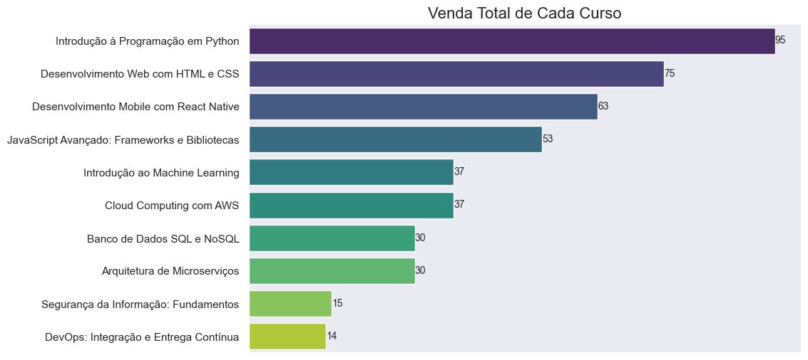
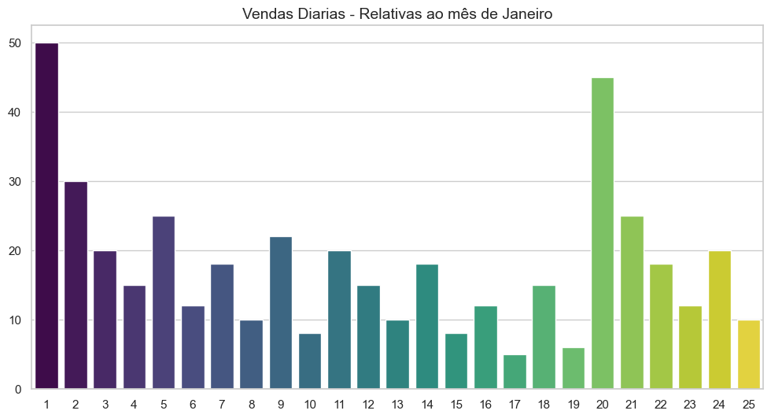
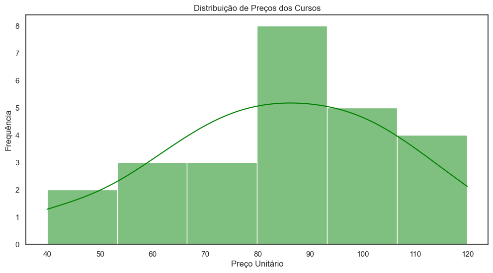
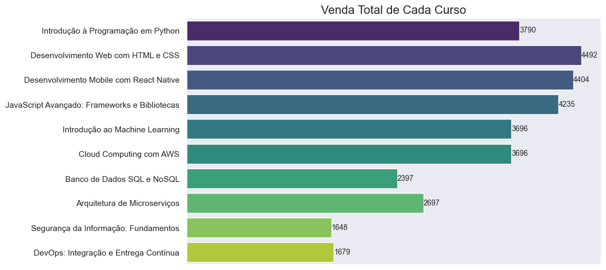
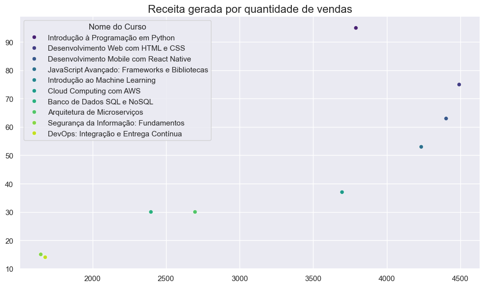
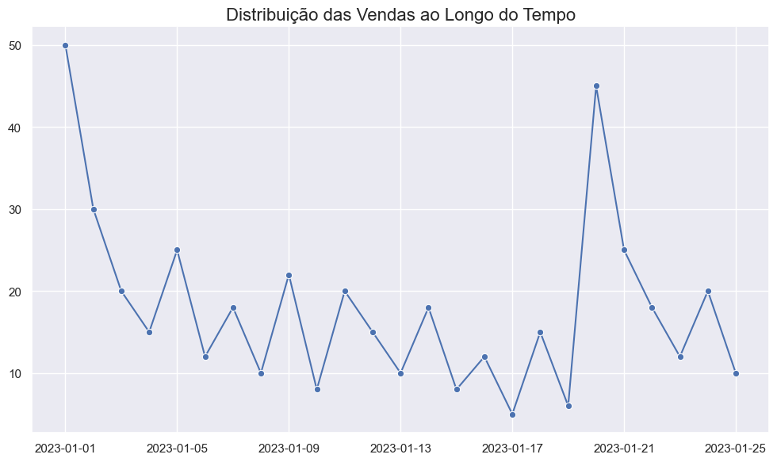

# 📚 Trilha Inicial Ciência de Dados Jr
Este projeto tem como objetivo realizar uma análise básica de dados utilizando Python, explorando um conjunto de dados pré-definido para extrair insights simples através de estatísticas descritivas e visualizações gráficas.

## Desafios Propostos:
   1. Calcular a receita total gerada pela venda dos cursos.
   2. Identificar o curso com o maior número de vendas.
   3. Visualizar a distribuição das vendas ao longo do tempo através de gráficos.

## Modelagem:
   1. Importação dos dados
   2. Tratamento dos dados
   3. Analise descritiva
   4. Criação de novas variaveis
   5. Nova analise descritiva
   6. Interpretação dos resultados

## Insights:
- O Curso mais vendido foi *Introdução à Programação em Python* com 95 vendas.
- As maiores vendas foram realizadas no dia 01 e no dia 20.
- Podemos notas uma relação inversamente proporcional entre preço e número de vendas.
- Temos uma maior quantidade de cursos vendidos pelos preços de 80 a 90 reais.
- O curso que gerou a maior receita foi o *Desenvolvimento Web com HTML e CSS*, com um total de R$ 4.492,00.
- Os 3 cursos que geraram mais receita não foram os mais vendidos: *Desenvolvimento Web com HTML e CSS* , *Desenvolvimento Mobile com React Native* e *JavaScript Avançado: Frameworks e Bibliotecas*.
- Segundas e quintas se mostraram dias consistentes para vendas de cursos, mesmop não sendo as maiores vendas. 

## Resposta ao Desafio:
1. Calcular a receita total gerada pela venda dos cursos.
   <a> A receita total gerada pelos cursos foi de R$ 32.735,10 </a>

2. Identificar o curso com o maior número de vendas.
   <a> O curso mais vendido foi *Introdução à Programação em Python* com 95 vendas.</a>

3. Visualizar a distribuição das vendas ao longo do tempo através de gráficos.

## Conclusão:
Nesse curto projeto para a Codigo Certo foi possivel responder as perguntas desafio, assim como extrair outros pontos significantes. O ponto que mais chama minha atenção é que dentre os 3 cursos que mais geraram receita nenhum deles foi o curso mais vendido, isso se torna bem claro tanto observando os gráficos de receita gerada por curso quanto quando observamos a correlação inversa entre preço e quantidade de vendas. Caso o foco da emrpesa seja aumentar sua receita, o foco do marketing deveria ser direcionado aos cursos de *Desenvolvimento Web com HTML e CSS*, *Desenvolvimento Mobile com React Native* e *JavaScript Avançado: Frameworks e Bibliotecas* , caso a divulgação seja o foco um foco no curso de *Introdução à Programação em Python* parece ser uma opção mais interessante, tanto pelo seu valor acessivel quanto pela comprovação de boas vendas. 

## Organização desse repositório:
- **data** --> Dados Originaisde vendas dos cursos.
- **reports** --> Imagens arquivas para uso no README.
- **notebooks** --> Arquivos notebooks com as análises feitas.

## Dicionario de Dados:
- **ID:** Identificador único de cada curso vendido.
- **Nome do Curso:** Nome do curso vendido na plataforma.
- **Quantidade de Vendas:** Número de vendas realizadas para cada curso.
- **Preço Unitário:** Preço unitário do curso.
- **Data:** Data da venda do curso.
- **Receita Gerada:** Receita total gerada pelo curso.
- **Quantidade Total de Vendas:** Quantidade de vendas realizada por um mesmo curso ao longo do tempo.

### **Configuração do Ambiente:**
1. **Instalar Python:** Certifique-se de ter o Python instalado em sua máquina.
2. **Instalar Jupyter Notebook:** Utilize o comando `pip install notebook` para instalar o Jupyter Notebook.
3. **Clone desse repositório:** 
4. **Instalar Bibliotecas:** Utilize o comando `pip install pandas matplotlib seaborn` para instalar as bibliotecas necessárias.
5. **Executar o Notebook:** Execute o notebook usando o comando `jupyter notebook` e navegue para o diretório do seu projeto.